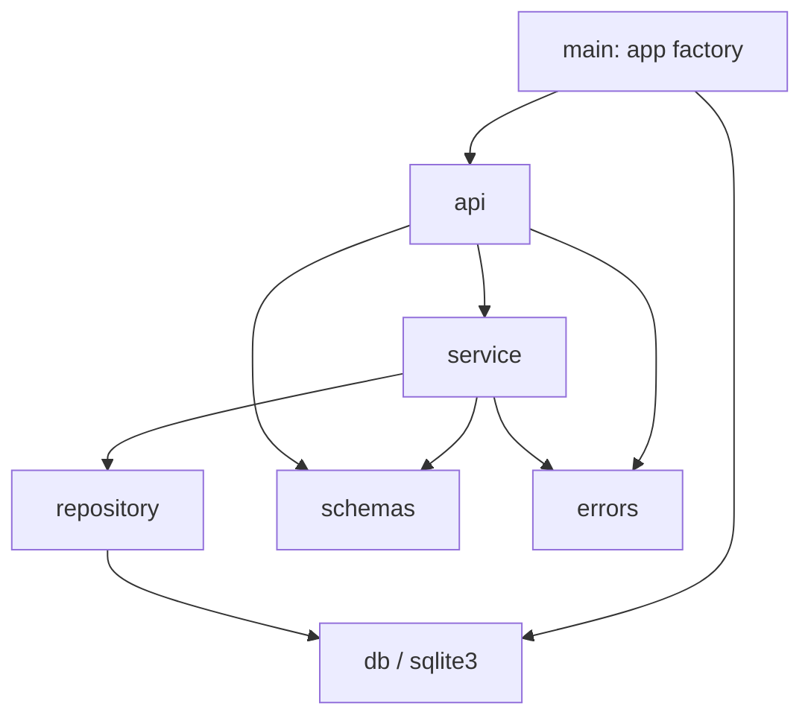
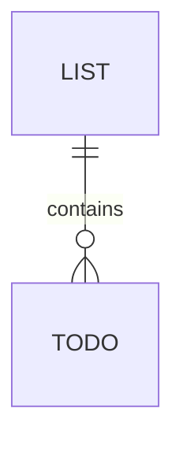

# Architecture Spine: Todo & Lists API

## Design Paradigm

Layered architecture, three layers plus shared schemas. Each layer maps to one module in `todo_api/`.

| Layer | Module | Owns |
| --- | --- | --- |
| API | `todo_api/api.py` | HTTP routes, status codes, request/response models |
| Service | `todo_api/service.py` | Business rules: existence checks, move, cascade semantics |
| Repository | `todo_api/repository.py` | All SQL; the only importer of `sqlite3` besides `db.py` |
| Infrastructure | `todo_api/db.py` | Connection lifecycle, schema creation, DB path config |
| Shared | `todo_api/schemas.py`, `todo_api/errors.py` | Pydantic models; `NotFoundError` |



Dependencies point downward only. No layer imports from a layer above it.

## Invariants & Rules

### AD-1: Only the repository speaks SQL [ADOPTED]

- **Binds:** all
- **Prevents:** routes or service issuing ad-hoc SQL with divergent column names or transaction handling.
- **Rule:** `sqlite3` is imported only in `repository.py` and `db.py`. Repository functions take a `sqlite3.Connection` as first argument and return plain dicts / Pydantic models or `None`.

### AD-2: One connection per request, committed at request end

- **Binds:** FR-1 to FR-11
- **Prevents:** partial writes (e.g. a move half-applied) and per-function commit styles that differ.
- **Rule:** `db.get_connection` is a FastAPI dependency that opens a connection, runs `PRAGMA foreign_keys = ON`, sets `row_factory = sqlite3.Row`, yields, commits on success, rolls back on exception, and closes. Repository and service never call `commit()` or `rollback()`.

### AD-3: Not-found flows through one exception

- **Binds:** FR-2 to FR-10, FR-12
- **Prevents:** some endpoints returning `null`/200, others 404 with different bodies.
- **Rule:** Repository returns `None` for a missing row. Service raises `errors.NotFoundError(entity, id)`. One exception handler registered in the app factory maps it to HTTP 404 with body `{"detail": "<Entity> <id> not found"}`. Routes never construct 404s themselves. Validation errors use FastAPI's default 422.

### AD-4: Deleting a List cascades to its Todos

- **Binds:** FR-4
- **Prevents:** orphaned Todos, or one path deleting Todos in code and another relying on the database.
- **Rule:** `todos.list_id` is `NOT NULL REFERENCES lists(id) ON DELETE CASCADE`. Service deletes only the List row; the database removes its Todos. Follows PRD assumption OQ-1.

### AD-5: A Todo has one mutation path, including move

- **Binds:** FR-7, FR-10
- **Prevents:** a separate move endpoint and an update endpoint that each change `list_id` with different checks.
- **Rule:** `PATCH /todos/{todo_id}` accepts any subset of `title`, `done`, `list_id` (applied via `model_dump(exclude_unset=True)`). When `list_id` is present, service verifies the target List exists before updating, else raises `NotFoundError("List", list_id)`. There is no separate move endpoint.

### AD-6: Schema is owned by `db.py` and created idempotently

- **Binds:** FR-11
- **Prevents:** tests and app creating tables differently; a restart wiping data.
- **Rule:** `db.init_db(path)` runs `CREATE TABLE IF NOT EXISTS` for both tables and is called from the app factory at startup. No `DROP` at startup. No migration tool.

### AD-7: Database location is injected

- **Binds:** FR-11, tests
- **Prevents:** tests writing to the real database file or to each other's.
- **Rule:** `main.create_app(db_path: str | None = None)` builds the app; when `None`, the path comes from env `TODO_DB_PATH`, default `todo.db`. Tests call `create_app(tmp_path / "test.db")`.

## Consistency Conventions

| Concern | Convention |
| --- | --- |
| Resource paths | `/lists`, `/lists/{list_id}`, `/lists/{list_id}/todos`, `/todos`, `/todos/{todo_id}`. Plural nouns, no trailing slash. |
| Create Todo | `POST /todos` with `{"title", "list_id", "done"?}`; missing List → 404 via AD-3. |
| Status codes | Create 201 with body; get/patch 200 with body; delete 204 no body; 404 not-found; 422 validation. |
| JSON fields | snake_case: List `{id, name}`, Todo `{id, title, done, list_id}`. |
| IDs | SQLite `INTEGER PRIMARY KEY AUTOINCREMENT`; path params typed `int`. |
| Validation | Pydantic `Field(min_length=1)` on `name` and `title`, with whitespace stripped. |
| Schema naming | `ListCreate`, `ListUpdate`, `ListRead`, `TodoCreate`, `TodoUpdate`, `TodoRead`. |
| Collections | Bare JSON arrays ordered by `id` ascending; empty array when none. |
| Tables | `lists(id, name)`, `todos(id, title, done INTEGER 0/1, list_id)`. |
| Tests | `tests/` with pytest + FastAPI `TestClient`, one fresh DB per test (AD-7). |

## Stack

| Name | Version |
| --- | --- |
| Python | 3.12 |
| FastAPI | 0.141.1 |
| Pydantic | 2.13.5 |
| sqlite3 | stdlib |
| uvicorn | 0.53.0 |
| pytest | 9.1.1 |
| httpx | 0.28.1 |

Versions ratified from the repository's `uv.lock`; no dependencies beyond `pyproject.toml`.

## Structural Seed



```text
spor/bmad/
  todo_api/
    main.py        # create_app, exception handler, startup init_db
    api.py         # routes
    service.py     # business rules
    repository.py  # SQL
    db.py          # connection dependency, schema, config
    schemas.py     # Pydantic models
    errors.py      # NotFoundError
  tests/
```

Run: `uv run uvicorn todo_api.main:app` from `spor/bmad/`, where `app = create_app()`.

## Capability → Architecture Map

| Capability | Lives in | Governed by |
| --- | --- | --- |
| FR-1 to FR-3 List CRUD | api, service, repository | AD-1, AD-3 |
| FR-4 Delete List | service, db schema | AD-4 |
| FR-5 to FR-8 Todo CRUD | api, service, repository | AD-1, AD-3, AD-5 |
| FR-9 Todos in a List | api, service | AD-3 (404 for missing List vs empty array) |
| FR-10 Move | service | AD-5 |
| FR-11 Persistence | db, main | AD-2, AD-6, AD-7 |
| FR-12 Error responses | main, errors | AD-3 |

## Deferred

- **Deployment and environments:** single local process via uvicorn; no container, hosting or multi-environment config until needed.
- **Concurrency:** single-process SQLite default locking is sufficient at this scale.
- **Migrations:** none until a schema change after first release.
- **Logging and observability:** uvicorn defaults.
- **Auth, pagination, filtering:** PRD non-goals.
- **Router split into per-resource files:** code may split `api.py` once it grows; the layer rules still hold.
